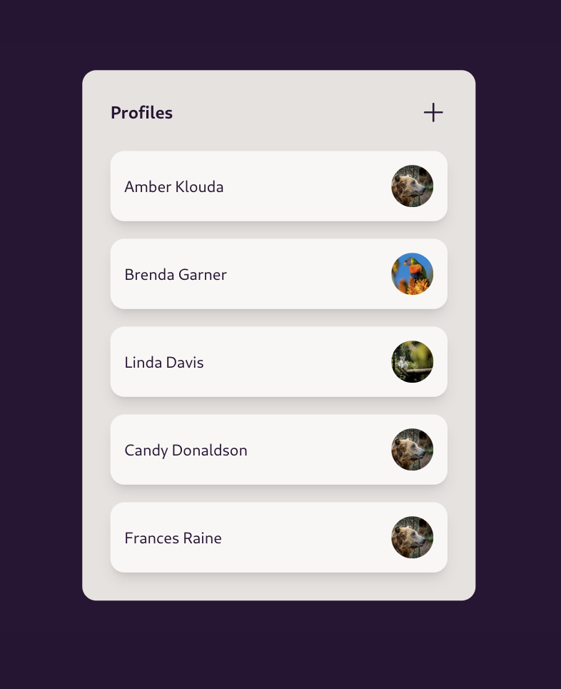
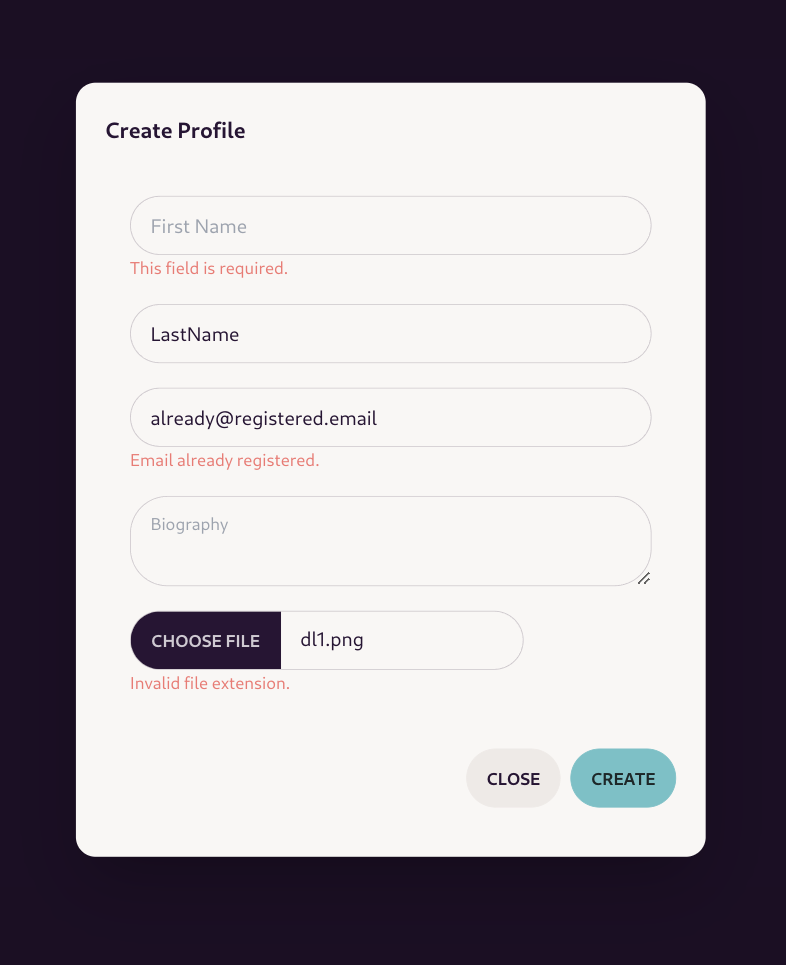
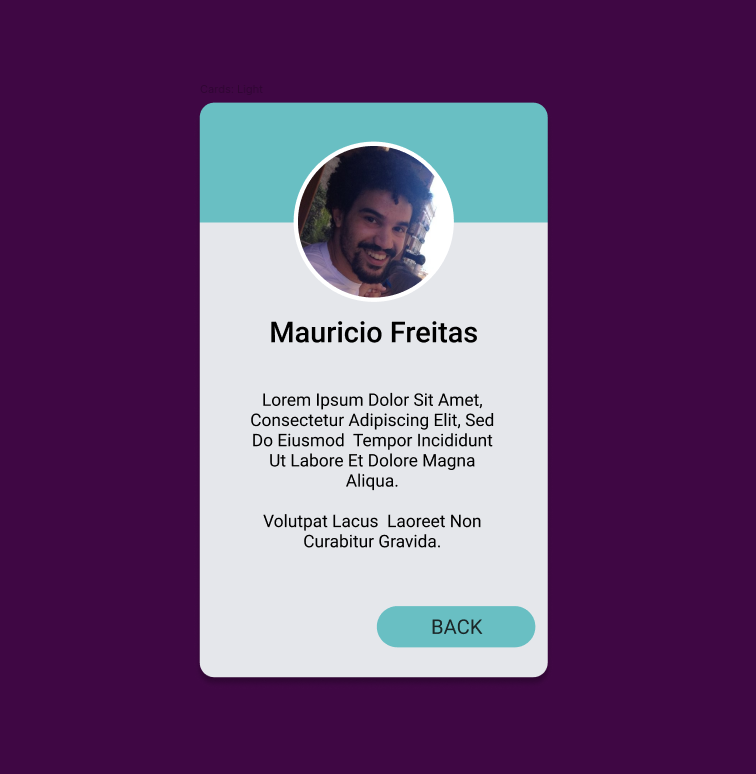

# Limitless - Skill Assessment Project

## Challenge Description

The objective of this sample project is to evaluate the candidate's skill
solving small tasks while still providing a representative setup and
environment, similar to the actual project.

Tech Stack:

- Python v3.11
- Django v4.2
- Vue JS v3
- [Tailwind v3.4](https://tailwindcss.com/)
- [Daisy UI v3.9](https://v3.daisyui.com/)

Evaluation criteria (in order of importance):

- Working code
- Ability to be consistent with project structure and styling
- Quality/Elegance of the solution

## Assignments

Depending on the role you're being evaluated, choose one of the assignments
below.

Tasks marked as _(Bonus)_ are optional, but are small extra challenges that
add to the evaluation.

For all of them:

- Setup the Project, start the services and load the page on http://localhost:8000
- _(Bonus)_ Start a git repository and keep track of changes in a single branch
  while developing the challenge.

Not only you're allowed, you're actually encouraged to ask questions and make
sure that the requirements in the assignment are clear.

Automated/AI tools are free to use.

Make sure to run the linters before submitting (see ["Local Development"](#local-development) for pre-commit).

### Full Stack Assignment

Make the "Create Profile" modal fully functional (triggered by the `+` icon on
the Profile card):

  

The backend needs to validate the data received from the frontend and return
201 with the data of the newly create profile, on success.

If there are validation errors, the messages need to be indicated in the modal,
under each fields, for example:

  

_(Bonus)_: Solve the problem using a single serializer.

### Frontend Only Assignment

Style `ProfileDetailsView` to look and display data like in the following mock:

  

Use DaisyUI's components and theme colors as much as possible.

Change the cursor inside the ProfileEntry cards to a pointer.

_(Bonus)_ Display an Avatar Placeholder, both in `ProfileListView` and `ProfileDetailsView`, if they don't have an image uploaded. Use the first and last name initials.

## Environment Setup & Development

Start by copying the environment file template and building the docker images.

    cp env.template .env
    docker compose build

Install frontend requirements and build it:

    cd frontend/
    npm install
    npm run build-only
    cd ..

Start containers:

    docker compose up -d

It's likely that the webapp service is loaded before the database, returning
the following error:

    django.db.utils.OperationalError: connection failed: Connection refused
    Is the server running on that host and accepting TCP/IP connections?

Fix it by restarting the `webapp` service:

    docker compose restart webapp

Setup Django:

    docker compose run --rm webapp manage.py migrate
    docker compose run --rm webapp manage.py collectstatic --no-input

To have some data to test, it's possible to generate some profile using the management command:

    docker compose run --rm webapp manage.py generate_profiles

To have access to admin panel it's necessary to create a super user:

    docker compose run --rm webapp manage.py createsuperuser

To access the services logs:

    docker compose logs webapp -f
    docker compose logs vite -f

### Local Development

    python -m venv .venv --prompt limitless
    source .venv/bin/activate
    pip install -e .[dev]
    pre-commit install

The project is setup so that the `manage.py` script is available directly in
the path. To generate migrations, for example, it's possible to simply run

    manage.py makemigrations
